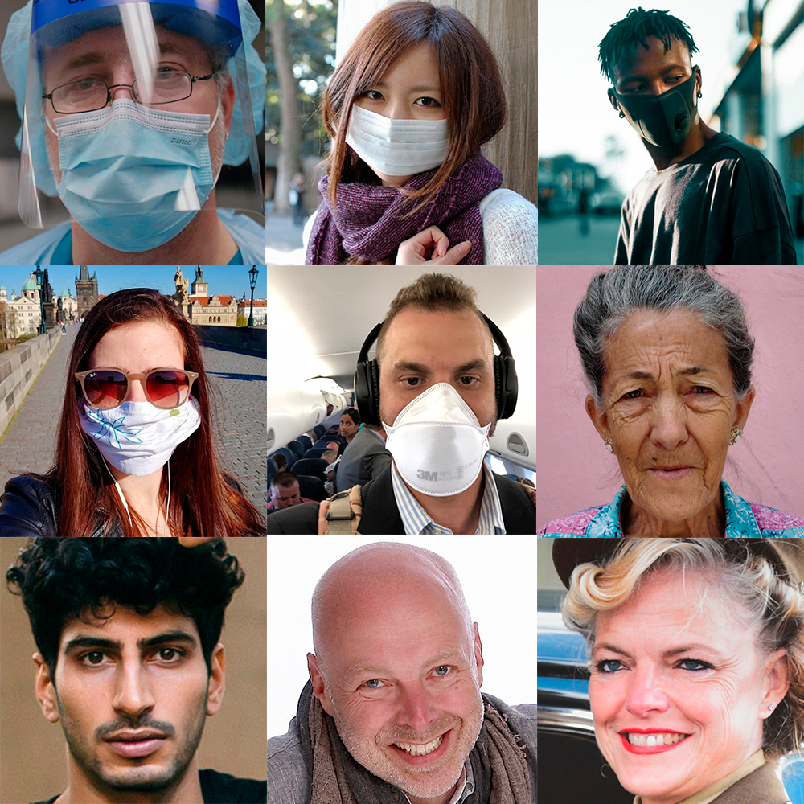
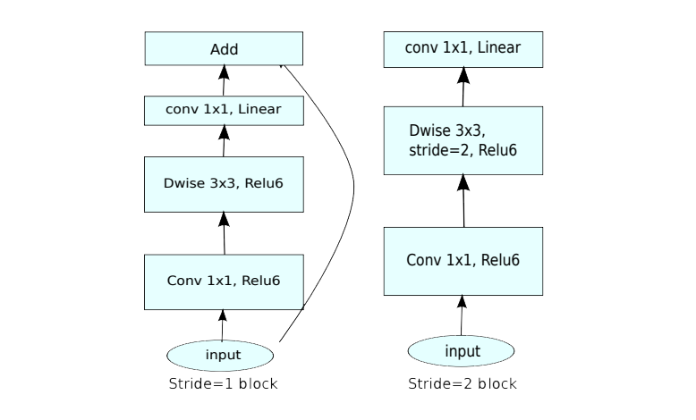
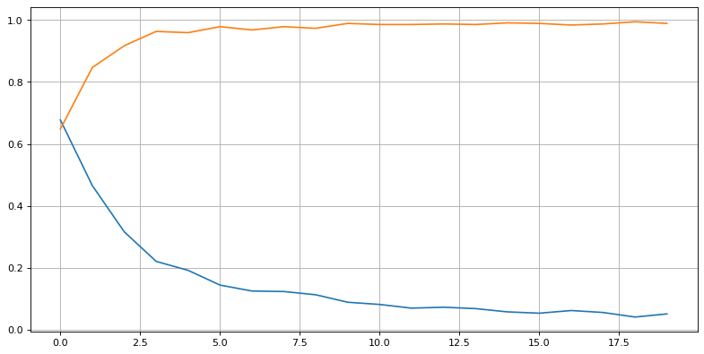

# Realtime Facemask Detection
## Introduction

The idea of this project borns when I saw a youtube video with a similar implementation. After seeing the video, I asked myself if it will be possible to create a similar model but as lightweight as possible to be able to run in a browser.

In order to implement my model, I've decided to use TensorFlow.js. This is a powerful library based on JavaScript. This library was totally new to me and I spent a few days researching because the documentation is not as complete as the TensorFlow core documentation.

I found the dataset on Kaggle. Due to the epidemiological situation is was quite easy to find a good dataset with faces with and without a facemask. Then, I will just have to use data augmentation in order to increase the size of the dataset.

## Model

Thanks to my previous experiences working with images, I knew that the approach must be Convolutional Neuronal Networks. This kind of architectures are the state-of-the-art when we have to work with images. This architecture also gets a lot of benefits working with GPUs so it will help the final users with this kind of hardware.

Due to the complexity of the task (there are a lot of different faces and a lot of different facemasks), I've decided that the best option was to use a pre-trained model and then perform some transfer learning. Using this option we have a model that is already able to detect features in the images and the only thing to do is add some layers to the top to perform the task of the detection.

### VGG-16

The first architecture that I tried was the VGG-16. This is one of the most famous CNN architectures. The drawback with this architecture is the size. With VGG-16 it is not possible to perform a realtime prediction on an average computer because of the number of trainable parameters.

However, thanks to this training, I verified that the problem can be solved. The goal then was to find the concrete architecture that will have a similar accuracy but being much more lightweight.

### MobileNetV2

This architecture was the MobileNetV2, a specific architecture designed by Google specifically for mobile devices. That was perfect because it can be easily integrated into a browser (the model has compatibility with TensorFlow.js), it will run on any machine (even a web browser in a phone) and its size allows it to perform realtime detection.

Once we add the additional layers, we train our model and we can see that just with 20 epochs and the data augmentation we can get even better results than using the VGG-16 architecture. In this case, the simplicity of the architecture returns better results.

## Testing

Now that we know that with the validation data the model seems to works, is time for some real environment testing. The first test that I performed on the model were some classification tasks based on images with different backgrounds and distance to the camera.

Those tests worked perfectly so...it was time to try to perform some realtime detection using the webcam. This time I just implemented a very basic Python script using OpenCV in order to use the camera and get the data from the images.

https://user-images.githubusercontent.com/46010361/176544536-af1a27a9-00e3-42b7-b3c7-2c11a173d2d2.mp4

This time it also worked very well. However, the model is not perfect. Sometimes when the person has glasses or a beard it gets a little confused. If our model were to be installed in some critical environment, we will have to solve these errors by adding more variety to the dataset, but, as it is not the goal of this project, we won't change anything.

## Web implementation 

The final part of the project was the web implementation. I exported the model and then I implemented the interface using the TensorFlow.js library. Once I got the images from the webcam, I had to preprocess those images in order to improve the performance using the MobileNetV2 architecture. Thankfully there are some preprocessing "examples" for this kind of architecture on the official repository of Tensorflow.js.

To end up, I've also implemented the blazeface model in order to draw the face boundaries and provide a better result.

https://user-images.githubusercontent.com/46010361/176544628-dcdadfac-fddc-4634-a607-19b1a0440d74.mp4

## Conclusion

During the development of this project, I've learned a lot of useful stuff related to the computer vision area. I've learned some transfer learning techniques using pre-trained models, I've learned to use data augmentation techniques to improve the quality of my dataset and I've learned to use the TensorFlow.js library to deploy my ML project much easily.

